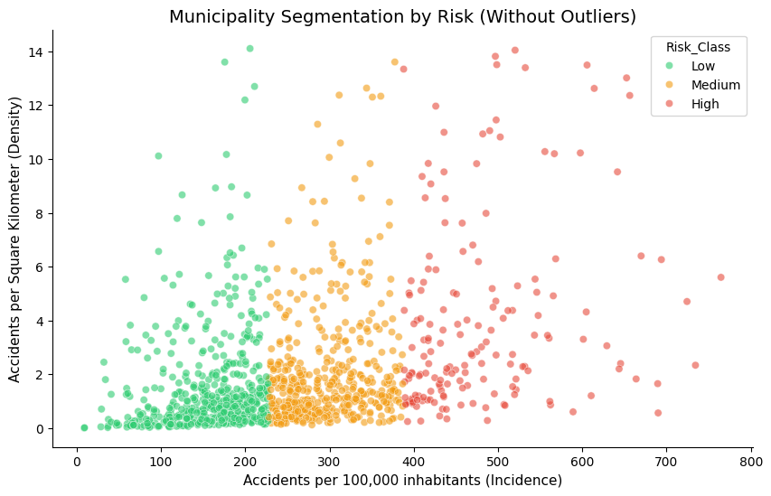
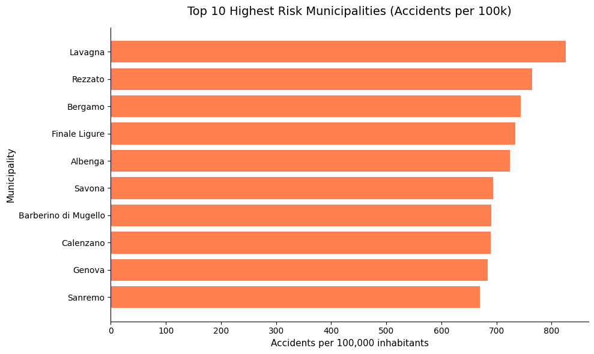

# Incidenti stradali in Italia: dove investire in sicurezza

Capstone Project del Master in Data Analytics di Boolean, consegnato ad agosto 2026.

**La domanda:** un'azienda che si occupa di traffico e prevenzione vuole sapere in quali comuni italiani conviene investire in sicurezza stradale. Servono numeri aggiornati, confrontabili tra comuni grandi e piccoli, e una dashboard che racconti il risultato.

**La risposta, in breve:** ho scaricato i dati ISTAT degli incidenti del 2024, li ho uniti a popolazione e superficie di ogni comune e ho diviso i 1.187 comuni sopra i 10.000 abitanti in tre classi di rischio: **544 basso, 471 medio, 172 alto**.



## Cosa contiene

| File | Cosa c'è |
| --- | --- |
| `main.ipynb` | Tutta l'analisi in Python: download, pulizia, indicatori, grafici, clustering |
| `Dashbord.pbix` | La dashboard Power BI con il racconto finale |
| `Slide deck capston project.pptx` | Cinque slide: problema, metodo, strumenti, risultati |
| `data/raw/` | I dati originali di ISTAT e SITUAS |
| `data/clean/` | I dataset prodotti dall'analisi, fino a quello con le classi di rischio |

## Come ho lavorato

1. **Dati ISTAT scaricati in automatico.** Il notebook chiama l'endpoint SDMX di ISTAT e chiede il CSV. Se il servizio non risponde, riparte dall'ultimo file salvato in `data/raw/`, così l'analisi gira lo stesso.
2. **Solo gli incidenti, solo l'ultimo anno.** Dal dataset tengo le righe `ROADACC` e le sommo per comune e per anno. Poi lavoro sul 2024, l'anno più recente disponibile.
3. **Unione con SITUAS.** ISTAT non ha né il nome del comune né la popolazione. Li prendo da SITUAS, insieme alla superficie, unendo le due tabelle sul codice del comune.
4. **Due indicatori.** Incidenti ogni 100.000 abitanti, per confrontare comuni di dimensioni diverse. Incidenti per chilometro quadrato, per misurare quanto sono concentrati sul territorio. Se manca il denominatore il valore resta vuoto, invece di dare un numero impossibile.
5. **Solo i comuni sopra i 10.000 abitanti.** Nei paesi piccoli bastano pochi incidenti per far schizzare il tasso. Tolgo anche i valori estremi (oltre 800 incidenti ogni 100.000 abitanti o 15 per chilometro quadrato): da 6.339 comuni arrivo a 1.187.
6. **K-Means in tre gruppi.** Raggruppo i comuni sui due indicatori e do un nome ai gruppi in base alla media degli incidenti per abitante: basso, medio, alto.
7. **Dashboard Power BI** per esplorare i risultati per comune.



## Strumenti

Python (pandas, NumPy, requests, Matplotlib, seaborn, scikit-learn), Jupyter, Power BI, Git.

## Limiti e cosa farei dopo

- **La popolazione è del 2020, gli incidenti del 2024.** È il file SITUAS che avevo a disposizione. Con la popolazione 2024 i tassi sarebbero più precisi.
- **Le due misure non sono sulla stessa scala.** Gli incidenti per abitante arrivano a centinaia, quelli per chilometro quadrato a poche unità, e il K-Means li tratta come distanze. Nel grafico si vede: i gruppi sono quasi strisce verticali, decisi dal primo indicatore. Il passo successivo è standardizzare le due colonne (per esempio con `StandardScaler`) e scegliere il numero di gruppi con il metodo del gomito.
- **Previsioni.** La traccia lasciava aperta l'idea di prevedere gli incidenti degli anni successivi: con la serie storica dei comuni si può provare una regressione.

## Come provarlo

```bash
git clone https://github.com/francesco-mauro/capston_project_final.git
cd capston_project_final
pip install pandas numpy requests matplotlib seaborn scikit-learn jupyter
jupyter notebook main.ipynb
```

La dashboard si apre con Power BI Desktop.

---

La traccia originale del Master è in [`Capstone Project README.md`](Capstone%20Project%20README.md).
